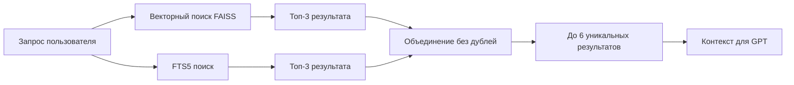

# 🤖 Диагност ПБ - Интеллектуальный Telegram-бот для неразрушающего контроля


**Диагност ПБ** — это современный AI-ассистент для специалистов в области неразрушающего контроля, оснащенный гибридной системой векторного поиска и базой знаний из 2306 фрагментов нормативных документов.

> ⚠️ **Важно**: Бот предоставляет справочную информацию. Обязательно проверяйте данные в официальных источниках и консультируйтесь с экспертами при принятии решений.

## 🎯 Описание проекта

### 🔍 Назначение
Интеллектуальный Telegram-бот предназначен для консультирования специалистов в области неразрушающего контроля, предоставляя точные ответы на основе актуальных нормативных документов и технической литературы.

### 🌟 Ключевые особенности

- **🧠 Гибридный поиск**: FAISS + FTS5 + SQLite для семантического и точного поиска
- **📚 Богатая база знаний**: 2306 фрагментов из 80 нормативных документов (ГОСТы, СТО, МР, ОСТ)
- **📊 Система источников**: Указание конкретных документов с метриками релевантности
- **🔄 Мониторинг**: Полная система логирования и метрик

### 🔬 Методы неразрушающего контроля

Бот предоставляет консультации по всем основным методам НК:

- **Ультразвуковой контроль (УК)** - дефектоскопия металлов и сварных соединений
- **Радиографический контроль (РК)** - просвечивание рентгеном и гамма-лучами
- **Магнитно-порошковый контроль (МПК)** - выявление поверхностных дефектов
- **Капиллярный контроль (ПВК)** - контроль проникающими веществами
- **Вихретоковый контроль (ВТК)** - контроль электропроводящих материалов
- **Акустико-эмиссионный контроль (АЭК)** - мониторинг развития дефектов
- **Тепловой контроль (ТК)** - инфракрасная термография
- **Визуальный и измерительный контроль (ВИК)** - осмотр и измерения

## 🏗️ Архитектура системы

### 📁 Структура проекта

```
Diagnost_PB/
├── 🤖 Основные файлы
│   ├── bot.py                          # Telegram-бот с FSM состояниями
│   ├── prompts.py                      # Экспертные промпты для НК
│   └── config.py                       # Централизованная конфигурация
│
├── 🔍 Гибридный векторный поиск
│   ├── load_excel_to_vectordb.py       # Загрузка Excel → SQLite
│   ├── build_faiss_index.py            # Создание FAISS индекса
│   ├── build_fts_index.py              # Создание FTS5 индекса
│   └── database_v1.xlsx                # Исходная база знаний
│

│
├── 🛠️ Утилиты
│   └── utils/
│       ├── vector_search.py            # Векторный поиск FAISS
│       ├── fts_search.py               # Полнотекстовый поиск FTS5
│       ├── hybrid_search.py            # Гибридный поиск (FAISS + FTS5)
│       ├── database.py                 # Работа с SQLite
│       ├── logger.py                   # Система логирования
│       ├── token_counter.py            # Подсчет токенов OpenAI
│       ├── session_cleaner.py          # Очистка сессий
│       └── exceptions.py               # Обработка исключений
│
├── 📁 Данные
│   ├── data/                           # Векторные индексы
│   │   ├── faiss_index.bin             # FAISS индекс (14.2 МБ)
│   │   └── vector_map.json             # Маппинг ID (44.9 КБ)
│   ├── logs/                           # Логи системы
│   └── knowledge_base_v2.db            # SQLite база знаний
│
├── 🧩 Дополнительные инструменты
    └── check_db.py                     # Проверка базы данных

```

## 🔄 Гибридный поиск: FAISS + SQLite + FTS5

### 📋 Принцип работы

**Трехуровневый гибридный подход** объединяет преимущества трех технологий:

- **FAISS** - для семантического поиска похожих векторов
- **FTS5** - для точного полнотекстового поиска
- **SQLite** - для хранения полных текстов и богатых метаданных

### ✅ Преимущества гибридного подхода

```python
# Разделение ответственности:
FAISS:     [0.123, -0.456, ...]  # Семантический поиск - БЫСТРО!
FTS5:      "точные термины"       # Полнотекстовый поиск - ТОЧНО!
SQLite:    "Полный текст..."      # Богатые данные - ГИБКО!
```

**Преимущества:**
- ⚡ **Быстрый поиск**: FAISS для семантики, FTS5 для точных терминов
- 🎯 **Точность**: FTS5 находит точные совпадения слов и фраз
- 💾 **Экономия памяти**: векторы отдельно от текстов
- 🔧 **Гибкость SQL**: сложные запросы и фильтры
- 📊 **Богатые метаданные**: полная информация о документах

### 🔍 Процесс гибридного поиска



### 📊 Сравнение типов поиска

| Тип поиска | Лучше для | Пример запроса |
|------------|-----------|----------------|
| **Векторный (FAISS)** | Семантический поиск | "проблемы с сердцем" |
| **FTS5** | Точные термины | "гипертония", "ГОСТ-123" |
| **Гибридный** | Комбинированный | "диагностика гипертонии" |

### 🔧 Настройка FTS5

#### Создание FTS индекса:
```bash
python build_fts_index.py
```

#### Конфигурация в `config.py`:
```python
# FTS search configuration
FTS_ENABLED = True                    # Включение/выключение FTS поиска
FTS_DEFAULT_LIMIT = 3                # Количество результатов FTS поиска
HYBRID_SEARCH_ENABLED = True         # Включение гибридного поиска
```

### 🔍 Процесс поиска (пошагово)

#### Шаг 1: 🎯 Параллельный поиск
```python
# Векторный поиск через FAISS
vector_results = vector_search(query_embedding, top_k=3)

# FTS поиск через SQLite FTS5
fts_results = fts_search(query, limit=3)
```

#### Шаг 2: 🔄 Объединение результатов
```python
# Объединяем результаты без дублей
merged_results = merge_search_results(vector_results, fts_results)
# Результат: до 6 уникальных чанков
```

#### Шаг 3: 📚 Формирование контекста
```python
# Создаем контекст для GPT из объединенных результатов
context = create_context_for_gpt(merged_results)
```


## 📚 База знаний

### 📊 Статистика базы знаний

- **📄 2306 текстовых фрагментов** из технических документов
- **📚 80 уникальных документов** (ГОСТы, СТО, МР, ОСТ, лекции)
- **🏷️ 13 типов документов** по различным методам НК
- **🔍 Семантический поиск** с использованием OpenAI Embeddings text-embedding-3-small
- **⚡ FAISS индекс** для мгновенного поиска релевантной информации

### 📁 Структура данных

#### SQLite база данных (knowledge_base_v2.db)
```sql
CREATE TABLE chunks (
    id INTEGER PRIMARY KEY AUTOINCREMENT,
    chunk_id TEXT UNIQUE NOT NULL,
    document_id INTEGER,
    doc_type_short TEXT,
    doc_type_full TEXT,
    doc_number TEXT,
    file_name TEXT,
    chunk_index INTEGER,
    chunk_text TEXT NOT NULL,
    created_at TIMESTAMP DEFAULT CURRENT_TIMESTAMP
);
```

#### FAISS индекс (data/faiss_index.bin)
- **Размер**: 14.2 МБ
- **Векторы**: 2306 × 1536 чисел
- **Модель**: OpenAI text-embedding-3-small

#### Маппинг ID (data/vector_map.json)
- **Размер**: 44.9 КБ
- **Формат**: `{"faiss_id": "chunk_id"}`
- **Назначение**: Связь между FAISS индексом и SQLite

### 🏷️ Типы документов

База знаний включает следующие типы нормативных документов:

- **ГОСТ** - Государственные стандарты РФ
- **СТО** - Стандарты организаций (Газпром, Роснефть)
- **МР** - Методические рекомендации
- **ОСТ** - Отраслевые стандарты
- **РД** - Руководящие документы
- **Лекции** - Учебные материалы по методам НК

## 🛠️ Установка и настройка

### Предварительные требования

- **Python 3.10+** или выше
- **Telegram Bot Token** (получается через [@BotFather](https://t.me/BotFather))
- **OpenAI API ключ** для работы с AI и векторным поиском
- **2-4 ГБ свободного места** для векторной базы данных

### 📦 Установка

#### 1. Клонирование репозитория

```bash
git clone https://github.com/Evgen-rus/Diagnost_PB.git /opt/diagnost_pb
# или
git clone https://github.com/Evgen-rus/Diagnost_PB.git .
```

#### 2. Настройка виртуального окружения

```bash
# Создание виртуального окружения
python3 -m venv venv

# Активация окружения
# Linux/MacOS:
source venv/bin/activate
# Windows:
venv\Scripts\activate

# Создание необходимых директорий
mkdir -p logs data

# Установка зависимостей
pip install -r requirements.txt
```

#### 3. Настройка конфигурации

```bash
# Создание файла конфигурации
cp .env.example .env
# Редактирование конфигурации
nano .env
```

Содержимое файла `.env`:

```env
# Telegram Bot
TELEGRAM_BOT_TOKEN=ваш_токен_от_BotFather

# OpenAI API
OPENAI_API_KEY=ваш_ключ_api_openai
OPENAI_MODEL=gpt-4o

# Logging
LOG_LEVEL=INFO
ENABLE_DIALOG_LOGGING=true
```

#### 4. Настройка векторной базы данных

```bash
# 1. Загрузка данных из Excel в SQLite
python load_excel_to_vectordb.py

# 2. Создание FAISS индекса (требует OPENAI_API_KEY)
python build_faiss_index.py

# 3. Создание FTS5 индекса для полнотекстового поиска
python build_fts_index.py

```

### 🐧 Настройка автозапуска (Linux)

#### Создание systemd службы

```bash
# Создание файла службы
sudo nano /etc/systemd/system/diagnost-pb-bot.service
```

Содержимое файла службы:

```ini
[Unit]
Description=Diagnost PB Bot
After=network.target

[Service]
Type=simple
User=root
WorkingDirectory=/opt/diagnost_pb
Environment=PATH=/opt/diagnost_pb/venv/bin:$PATH
ExecStart=/opt/diagnost_pb/venv/bin/python bot.py
Restart=always
RestartSec=10

[Install]
WantedBy=multi-user.target
```

#### Запуск службы

```bash
# Перезагрузка конфигурации systemd
systemctl daemon-reload

# Включение автозапуска
systemctl enable diagnost-pb-bot

# Запуск службы
systemctl start diagnost-pb-bot

# Проверка статуса
systemctl status diagnost-pb-bot
```

### 🔧 Полезные команды управления

```bash
# Просмотр логов в реальном времени
journalctl -u diagnost-pb-bot -f

# Просмотр последних 100 строк логов
journalctl -u diagnost-pb-bot -n 100

# Перезапуск бота
systemctl restart diagnost-pb-bot

# Остановка бота
systemctl stop diagnost-pb-bot

# Отключение автозапуска
systemctl disable diagnost-pb-bot
```

### 🔄 Обновление системы

```bash
# Переход в директорию бота
cd /opt/diagnost_pb

# Остановка сервиса
systemctl stop diagnost-pb-bot

# Получение последних изменений
git pull

# Активация окружения
source venv/bin/activate

# Обновление зависимостей
pip install -r requirements.txt

# Запуск сервиса
systemctl start diagnost-pb-bot
```

## 🚀 Запуск и использование

### 🎮 Основные команды бота

- `/start` - Запуск диалога с ботом
- `/cancel` - Прервать текущее взаимодействие

### 🔍 Функциональные возможности

- **Объясни** - развернутое объяснение текущей темы
- **Новый вопрос** - сброс контекста для нового диалога
- **Поиск по базе знаний** - автоматический для каждого запроса

### 💬 Примеры использования

#### Типичные запросы к боту:

```
❓ "Какие методы ультразвукового контроля существуют?"
❓ "Как настроить аппарат для магнитно-порошкового контроля?"
❓ "Требования ГОСТ к радиографическому контролю сварных швов"
❓ "Как интерпретировать результаты капиллярного контроля?"
❓ "Какое оборудование нужно для акустико-эмиссионного контроля?"
```

#### Ответы с источниками:

Бот предоставляет точные ответы с указанием:
- **Конкретных документов** (ГОСТ, СТО, МР)
- **Релевантности источника** (0.0-1.0)
- **Номеров разделов** и пунктов нормативов
- **Практических рекомендаций** от экспертов

### 🔧 Проверка работоспособности

#### Проверка базы данных
```bash
python check_db.py
```

#### Анализ данных
```bash
python analyze_database.py
```

### 🚨 Устранение неполадок

Если бот не отвечает, проверьте:

1. **Статус службы**: `systemctl status diagnost-pb-bot`
2. **Логи сервиса**: `journalctl -u diagnost-pb-bot -n 100`
3. **Правильность токенов** в файле `.env`
4. **Доступность API OpenAI** (возможны ограничения по региону)
5. **Наличие векторного индекса**: проверьте файлы в папке `data/`


## 🔧 Конфигурация

### 📋 Переменные окружения

#### Обязательные переменные
```env
# Telegram Bot Token (получить через @BotFather)
TELEGRAM_BOT_TOKEN=your_bot_token_here

# OpenAI API Key (для AI и векторного поиска)
OPENAI_API_KEY=your_openai_api_key_here
```

#### Опциональные переменные
```env
# Модель OpenAI (по умолчанию: gpt-4.1-mini)
OPENAI_MODEL=gpt-4o

# Уровень логирования (DEBUG, INFO, WARNING, ERROR)
LOG_LEVEL=INFO

# Включение логирования диалогов
ENABLE_DIALOG_LOGGING=true

# FTS поиск (по умолчанию: включен)
FTS_ENABLED=true

# Гибридный поиск (по умолчанию: включен)
HYBRID_SEARCH_ENABLED=true
```

### ⚙️ Настройки векторного поиска

#### Конфигурация в `config.py`
```python
# Количество чанков для поиска по умолчанию
DEFAULT_TOP_K = 3

# Максимальное количество токенов для контекста
MAX_CONTEXT_TOKENS = 1000

# Размерность эмбеддингов OpenAI text-embedding-3-small
EMBEDDING_DIMENSION = 1536
```

### 🗃️ Файлы данных

#### Векторная база данных
- **`knowledge_base_v2.db`** - SQLite база с текстами и метаданными
- **`data/faiss_index.bin`** - FAISS индекс для быстрого поиска
- **`data/vector_map.json`** - Маппинг между FAISS и SQLite ID

#### Исходные данные
- **`database_v1.xlsx`** - Исходная база знаний из 2306 чанков
- **`logs/`** - Директория с логами системы

## 🚀 Технологии

### 🤖 AI и машинное обучение

- **OpenAI API**: GPT-модели для генерации ответов
- **FAISS**: Meta's библиотека для векторного поиска
- **OpenAI Embeddings**: text-embedding-3-small для создания векторов
- **RAG**: Retrieval-Augmented Generation архитектура

### 🔧 Backend и база данных

- **Python 3.10+**: основной язык разработки
- **aiogram 3.17.0**: современный фреймворк для Telegram-ботов
- **SQLite**: хранение диалогов, логов и векторной базы
- **SQLite FTS5**: полнотекстовый поиск для точных терминов
- **pandas, numpy**: обработка и анализ данных
- **tiktoken**: оптимизация использования токенов


## 📝 Разработка

### 🎯 Принципы разработки

- **Модульность**: разделение на независимые компоненты
- **Читаемость**: подробная документация и комментарии
- **Надежность**: обработка ошибок и логирование
- **Масштабируемость**: архитектура для расширения функциональности

### 🔄 Расширение функциональности

#### Добавление новых методов НК
1. Обновите `prompts.py` с новыми экспертными инструкциями
2. Добавьте соответствующие документы в `database_v1.xlsx`
3. Пересоздайте векторный индекс: `python build_faiss_index.py`

#### Интеграция новых источников данных
1. Модифицируйте `load_excel_to_vectordb.py` для новых форматов
2. Обновите схему базы данных в `utils/database.py`
3. Адаптируйте `utils/vector_search.py` под новые поля
4. Пересоздайте FTS индекс: `python build_fts_index.py`

