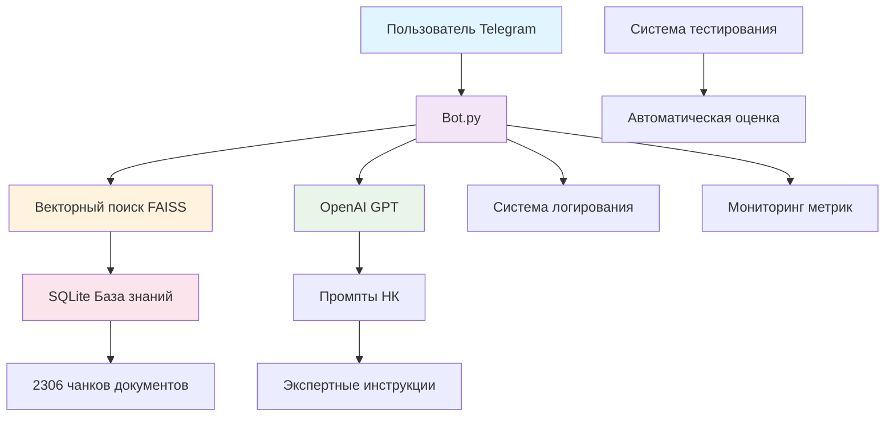

# 🤖 Диагност ПБ - Интеллектуальный Telegram-бот для неразрушающего контроля


**Диагност ПБ** — это современный AI-ассистент для специалистов в области неразрушающего контроля, оснащенный гибридной системой векторного поиска и базой знаний из 2306 фрагментов нормативных документов.

> ⚠️ **Важно**: Бот предоставляет справочную информацию. Обязательно проверяйте данные в официальных источниках и консультируйтесь с экспертами при принятии решений.

## 🎯 Описание проекта

### 🔍 Назначение
Интеллектуальный Telegram-бот предназначен для консультирования специалистов в области неразрушающего контроля, предоставляя точные ответы на основе актуальных нормативных документов и технической литературы.

### 🌟 Ключевые особенности

- **🧠 Гибридный векторный поиск**: FAISS + SQLite для мгновенного поиска релевантной информации
- **📚 Богатая база знаний**: 2306 фрагментов из 80 нормативных документов (ГОСТы, СТО, МР, ОСТ)
- **📊 Система источников**: Указание конкретных документов с метриками релевантности
- **🧪 Автоматизированное тестирование**: Система оценки качества ответов
- **🔄 Мониторинг**: Полная система логирования и метрик

### 🔬 Методы неразрушающего контроля

Бот предоставляет консультации по всем основным методам НК:

- **Ультразвуковой контроль (УК)** - дефектоскопия металлов и сварных соединений
- **Радиографический контроль (РК)** - просвечивание рентгеном и гамма-лучами
- **Магнитно-порошковый контроль (МПК)** - выявление поверхностных дефектов
- **Капиллярный контроль (ПВК)** - контроль проникающими веществами
- **Вихретоковый контроль (ВТК)** - контроль электропроводящих материалов
- **Акустико-эмиссионный контроль (АЭК)** - мониторинг развития дефектов
- **Тепловой контроль (ТК)** - инфракрасная термография
- **Визуальный и измерительный контроль (ВИК)** - осмотр и измерения

## 🏗️ Архитектура системы

### 🔄 Компоненты системы



### 📁 Структура проекта

```
Diagnost_PB/
├── 🤖 Основные файлы
│   ├── bot.py                          # Telegram-бот с FSM состояниями
│   ├── prompts.py                      # Экспертные промпты для НК
│   └── config.py                       # Централизованная конфигурация
│
├── 🔍 Гибридный векторный поиск
│   ├── load_excel_to_vectordb.py       # Загрузка Excel → SQLite
│   ├── build_faiss_index.py            # Создание FAISS индекса
│   ├── test_vector_search.py           # Тестирование поиска
│   └── database_v1.xlsx                # Исходная база знаний
│

│
├── 🛠️ Утилиты
│   └── utils/
│       ├── vector_search.py            # Векторный поиск FAISS
│       ├── database.py                 # Работа с SQLite
│       ├── logger.py                   # Система логирования
│       ├── token_counter.py            # Подсчет токенов OpenAI
│       ├── session_cleaner.py          # Очистка сессий
│       └── exceptions.py               # Обработка исключений
│
├── 📁 Данные
│   ├── data/                           # Векторные индексы
│   │   ├── faiss_index.bin             # FAISS индекс (14.2 МБ)
│   │   └── vector_map.json             # Маппинг ID (44.9 КБ)
│   ├── logs/                           # Логи системы
│   └── knowledge_base_v2.db            # SQLite база знаний
│
├── 🧩 Дополнительные инструменты
│   ├── analyze_database.py             # Анализатор Excel файлов
│   └── check_db.py                     # Проверка базы данных
│
└── 📖 Документация
    ├── INSTALL.md                      # Инструкция по установке
    ├── HYBRID_VECTOR_SEARCH_GUIDE.md   # Руководство по векторному поиску
    ├── VECTOR_DATABASE_SETUP.md        # Настройка векторной базы

```

## 🔄 Гибридный векторный поиск: FAISS + SQLite

### 📋 Принцип работы

**Гибридный подход** объединяет преимущества двух технологий:

- **FAISS** - для быстрого поиска похожих векторов в памяти
- **SQLite** - для хранения полных текстов и богатых метаданных

### ✅ Преимущества гибридного подхода

```python
# Разделение ответственности:
FAISS:     [0.123, -0.456, ...]  # Только векторы - БЫСТРО!
Маппинг:   {"0": "1_0"}          # Связки ID - КОМПАКТНО!  
SQLite:    "Полный текст..."      # Богатые данные - ГИБКО!
```

**Преимущества:**
- ⚡ **Быстрый поиск**: FAISS оптимизирован для векторов
- 💾 **Экономия памяти**: векторы отдельно от текстов
- 🔧 **Гибкость SQL**: сложные запросы и фильтры
- 📊 **Богатые метаданные**: полная информация о документах

### 🔍 Процесс поиска (пошагово)

#### Шаг 1: 🎯 Создание вектора запроса
```python
# Запрос: "Что такое диагностика?"
query_embedding = get_embedding_openai("Что такое диагностика?")
# Результат: [0.444, -0.123, 0.888, ...] (1536 чисел)
```

#### Шаг 2: 🔍 Поиск в FAISS индексе
```python
# FAISS ищет похожие векторы используя косинусное сходство
similarities, indices = vector_store.search(query_embedding, top_k=3)
# Результат: 
# similarities = [0.892, 0.876, 0.863]  # Больше = лучше
# indices = [567, 1203, 89]
```

#### Шаг 3: 🗺️ Маппинг FAISS ID → chunk ID
```python
# Переводим FAISS ID в chunk ID через vector_map.json
faiss_ids = [567, 1203, 89]
chunk_ids = []

for faiss_id in faiss_ids:
    chunk_id = vector_store.vector_map.get(str(faiss_id))
    chunk_ids.append(chunk_id)
# Результат: chunk_ids = ["58_0", "70_12", "70_13"]
```

#### Шаг 4: 📚 Получение полных текстов из SQLite
```python
# SQL запрос для получения полной информации
cursor.execute(
    f"SELECT * FROM chunks WHERE chunk_id IN (?, ?, ?)",
    chunk_ids
)

# Результат: полные документы с метаданными
chunks = [
    {
        'chunk_id': '58_0',
        'document_id': 58,
        'doc_type_short': 'СТО',
        'chunk_text': 'С целью обеспечения промышленной безопасности...',
        'similarity': 0.892  # Косинусное сходство
    },
    # ... остальные чанки
]
```

### 📊 Сравнение подходов

| Критерий | Только FAISS | Только SQLite | **Гибридный** |
|----------|---------------|---------------|---------------|
| **Скорость поиска** | 🚀 Очень быстро | 🐌 Медленно | ⚡ Быстро |
| **Потребление памяти** | 💾 Много | 💾 Мало | 💾 Средне |
| **Богатство метаданных** | ❌ Ограничено | ✅ Полное | ✅ Полное |
| **Гибкость запросов** | ❌ Только векторы | ✅ SQL | ✅ Векторы + SQL |
| **Сложность настройки** | 🟢 Простая | 🟡 Средняя | 🟡 Средняя |
| **Масштабируемость** | 🟡 Ограничена RAM | ✅ Хорошая | ✅ Отличная |

## 📚 База знаний

### 📊 Статистика базы знаний

- **📄 2306 текстовых фрагментов** из технических документов
- **📚 80 уникальных документов** (ГОСТы, СТО, МР, ОСТ, лекции)
- **🏷️ 13 типов документов** по различным методам НК
- **🔍 Семантический поиск** с использованием OpenAI Embeddings text-embedding-3-small
- **⚡ FAISS индекс** для мгновенного поиска релевантной информации

### 📁 Структура данных

#### SQLite база данных (knowledge_base_v2.db)
```sql
CREATE TABLE chunks (
    id INTEGER PRIMARY KEY AUTOINCREMENT,
    chunk_id TEXT UNIQUE NOT NULL,
    document_id INTEGER,
    doc_type_short TEXT,
    doc_type_full TEXT,
    doc_number TEXT,
    file_name TEXT,
    chunk_index INTEGER,
    chunk_text TEXT NOT NULL,
    created_at TIMESTAMP DEFAULT CURRENT_TIMESTAMP
);
```

#### FAISS индекс (data/faiss_index.bin)
- **Размер**: 14.2 МБ
- **Векторы**: 2306 × 1536 чисел
- **Модель**: OpenAI text-embedding-3-small

#### Маппинг ID (data/vector_map.json)
- **Размер**: 44.9 КБ
- **Формат**: `{"faiss_id": "chunk_id"}`
- **Назначение**: Связь между FAISS индексом и SQLite

### 🏷️ Типы документов

База знаний включает следующие типы нормативных документов:

- **ГОСТ** - Государственные стандарты РФ
- **СТО** - Стандарты организаций (Газпром, Роснефть)
- **МР** - Методические рекомендации
- **ОСТ** - Отраслевые стандарты
- **РД** - Руководящие документы
- **Лекции** - Учебные материалы по методам НК

## 🧪 Система тестирования

### 🎯 Возможности тестирования

- **Одиночные тесты**: проверка конкретного вопроса
- **Пакетное тестирование**: серия тестов из файла
- **Метрики производительности**: токены, время, стоимость
- **Экспорт результатов**: CSV и Excel форматы
- **Оценка качества**: шкала от -2 до +2 баллов


## 🛠️ Установка и настройка

### Предварительные требования

- **Python 3.10+** или выше
- **Telegram Bot Token** (получается через [@BotFather](https://t.me/BotFather))
- **OpenAI API ключ** для работы с AI и векторным поиском
- **2-4 ГБ свободного места** для векторной базы данных

### 📦 Установка

#### 1. Клонирование репозитория

```bash
git clone https://github.com/Evgen-rus/Diagnost_PB.git /opt/diagnost_pb
# или
git clone https://github.com/Evgen-rus/Diagnost_PB.git .
```

#### 2. Настройка виртуального окружения

```bash
# Создание виртуального окружения
python3 -m venv venv

# Активация окружения
# Linux/MacOS:
source venv/bin/activate
# Windows:
venv\Scripts\activate

# Создание необходимых директорий
mkdir -p logs data

# Установка зависимостей
pip install -r requirements.txt
```

#### 3. Настройка конфигурации

```bash
# Создание файла конфигурации
cp .env.example .env
# Редактирование конфигурации
nano .env
```

Содержимое файла `.env`:

```env
# Telegram Bot
TELEGRAM_BOT_TOKEN=ваш_токен_от_BotFather

# OpenAI API
OPENAI_API_KEY=ваш_ключ_api_openai
OPENAI_MODEL=gpt-4o-mini

# Logging
LOG_LEVEL=INFO
ENABLE_DIALOG_LOGGING=true
```

#### 4. Настройка векторной базы данных

```bash
# 1. Загрузка данных из Excel в SQLite
python load_excel_to_vectordb.py

# 2. Создание FAISS индекса (требует OPENAI_API_KEY)
python build_faiss_index.py

# 3. Тестирование векторного поиска
python test_vector_search.py
```

### 🐧 Настройка автозапуска (Linux)

#### Создание systemd службы

```bash
# Создание файла службы
sudo nano /etc/systemd/system/diagnost-pb-bot.service
```

Содержимое файла службы:

```ini
[Unit]
Description=Diagnost PB Bot
After=network.target

[Service]
Type=simple
User=root
WorkingDirectory=/opt/diagnost_pb
Environment=PATH=/opt/diagnost_pb/venv/bin:$PATH
ExecStart=/opt/diagnost_pb/venv/bin/python bot.py
Restart=always
RestartSec=10

[Install]
WantedBy=multi-user.target
```

#### Запуск службы

```bash
# Перезагрузка конфигурации systemd
systemctl daemon-reload

# Включение автозапуска
systemctl enable diagnost-pb-bot

# Запуск службы
systemctl start diagnost-pb-bot

# Проверка статуса
systemctl status diagnost-pb-bot
```

### 🔧 Полезные команды управления

```bash
# Просмотр логов в реальном времени
journalctl -u diagnost-pb-bot -f

# Просмотр последних 100 строк логов
journalctl -u diagnost-pb-bot -n 100

# Перезапуск бота
systemctl restart diagnost-pb-bot

# Остановка бота
systemctl stop diagnost-pb-bot

# Отключение автозапуска
systemctl disable diagnost-pb-bot
```

### 🔄 Обновление системы

```bash
# Переход в директорию бота
cd /opt/diagnost_pb

# Остановка сервиса
systemctl stop diagnost-pb-bot

# Получение последних изменений
git pull

# Активация окружения
source venv/bin/activate

# Обновление зависимостей
pip install -r requirements.txt

# Запуск сервиса
systemctl start diagnost-pb-bot
```

## 🚀 Запуск и использование

### 🎮 Основные команды бота

- `/start` - Запуск диалога с ботом
- `/cancel` - Прервать текущее взаимодействие

### 🔍 Функциональные возможности

- **Объясни** - развернутое объяснение текущей темы
- **Новый вопрос** - сброс контекста для нового диалога
- **Поиск по базе знаний** - автоматический для каждого запроса

### 💬 Примеры использования

#### Типичные запросы к боту:

```
❓ "Какие методы ультразвукового контроля существуют?"
❓ "Как настроить аппарат для магнитно-порошкового контроля?"
❓ "Требования ГОСТ к радиографическому контролю сварных швов"
❓ "Как интерпретировать результаты капиллярного контроля?"
❓ "Какое оборудование нужно для акустико-эмиссионного контроля?"
```

#### Ответы с источниками:

Бот предоставляет точные ответы с указанием:
- **Конкретных документов** (ГОСТ, СТО, МР)
- **Релевантности источника** (0.0-1.0)
- **Номеров разделов** и пунктов нормативов
- **Практических рекомендаций** от экспертов

### 🔧 Проверка работоспособности

#### Проверка базы данных
```bash
python check_db.py
```

#### Тестирование векторного поиска
```bash
python test_vector_search.py
```

#### Анализ данных
```bash
python analyze_database.py
```

### 🚨 Устранение неполадок

Если бот не отвечает, проверьте:

1. **Статус службы**: `systemctl status diagnost-pb-bot`
2. **Логи сервиса**: `journalctl -u diagnost-pb-bot -n 100`
3. **Правильность токенов** в файле `.env`
4. **Доступность API OpenAI** (возможны ограничения по региону)
5. **Наличие векторного индекса**: проверьте файлы в папке `data/`

## 📋 Модули и файлы

### 🤖 Основные модули

#### `bot.py` - Telegram-бот
- **Назначение**: Основной модуль Telegram-бота с FSM состояниями
- **Функции**:
  - Обработка команд `/start`, `/cancel`
  - Управление состояниями диалога
  - Интеграция с OpenAI API
  - Векторный поиск по базе знаний
  - Логирование взаимодействий

#### `config.py` - Конфигурация
- **Назначение**: Централизованная настройка системы
- **Функции**:
  - Загрузка переменных окружения
  - Конфигурация OpenAI API
  - Настройки векторного поиска
  - Обработка ошибок конфигурации

#### `prompts.py` - Экспертные промпты
- **Назначение**: Системные промпты для AI-ассистента
- **Функции**:
  - Экспертные инструкции по НК
  - Защита от офтопик вопросов
  - Требования к точности ответов
  - Форматирование ответов

### 🔍 Система векторного поиска

#### `load_excel_to_vectordb.py`
- **Назначение**: Загрузка данных из Excel в SQLite
- **Функции**:
  - Чтение `database_v1.xlsx`
  - Создание таблицы `chunks`
  - Сохранение текстов с метаданными

#### `build_faiss_index.py`
- **Назначение**: Создание FAISS индекса
- **Функции**:
  - Создание векторов через OpenAI API
  - Построение FAISS индекса
  - Сохранение маппинга ID

#### `test_vector_search.py`
- **Назначение**: Тестирование векторного поиска
- **Функции**:
  - Проверка работы FAISS индекса
  - Тестирование поиска по запросам
  - Анализ релевантности результатов

### 🛠️ Утилиты

#### `utils/vector_search.py`
- **Назначение**: Управление векторным поиском
- **Классы**:
  - `FAISSVectorStore`: управление FAISS индексом
- **Функции**:
  - `get_embedding_openai()`: получение векторов
  - `search_relevant_chunks()`: поиск релевантных чанков
  - `get_context_for_query()`: формирование контекста

#### `utils/database.py`
- **Назначение**: Работа с SQLite базой данных
- **Функции**:
  - `init_database()`: инициализация таблиц
  - `log_message()`: сохранение сообщений
  - `get_chunks_by_ids()`: получение чанков по ID

#### `utils/logger.py`
- **Назначение**: Система логирования
- **Классы**:
  - `ContextAdapter`: контекстное логирование
- **Функции**:
  - `setup_logging()`: настройка логгеров
  - `get_user_logger()`: логгер для пользователей
  - `log_user_message()`: логирование сообщений

#### `utils/token_counter.py`
- **Назначение**: Подсчет токенов OpenAI
- **Функции**:
  - Подсчет токенов в тексте
  - Оптимизация использования API
  - Контроль лимитов

#### `utils/session_cleaner.py`
- **Назначение**: Очистка неактивных сессий
- **Функции**:
  - Автоматическая очистка памяти
  - Управление активными сессиями
  - Предотвращение утечек памяти

#### `utils/exceptions.py`
- **Назначение**: Обработка исключений
- **Классы**:
  - `ConfigError`: ошибки конфигурации
  - `VectorSearchError`: ошибки поиска
  - `DatabaseError`: ошибки базы данных


### 🛠️ Утилиты диагностики

#### `check_db.py`
- **Назначение**: Проверка базы данных
- **Функции**:
  - Проверка таблиц
  - Анализ содержимого
  - Статистика чанков

#### `export_dialogs.py`
- **Назначение**: Экспорт диалогов
- **Функции**:
  - Экспорт в CSV
  - Фильтрация по пользователям
  - Анализ диалогов

### 🧩 Дополнительные инструменты

#### `analyze_database.py`
- **Назначение**: Интерактивный анализатор Excel файлов
- **Классы**:
  - `DatabaseAnalyzer`: анализ данных
- **Функции**:
  - Быстрый просмотр данных
  - Статистический анализ
  - Создание визуализаций
  - Генерация HTML отчетов

## 🔧 Конфигурация

### 📋 Переменные окружения

#### Обязательные переменные
```env
# Telegram Bot Token (получить через @BotFather)
TELEGRAM_BOT_TOKEN=your_bot_token_here

# OpenAI API Key (для AI и векторного поиска)
OPENAI_API_KEY=your_openai_api_key_here
```

#### Опциональные переменные
```env
# Модель OpenAI (по умолчанию: gpt-4.1-mini)
OPENAI_MODEL=gpt-4.1-mini

# Уровень логирования (DEBUG, INFO, WARNING, ERROR)
LOG_LEVEL=INFO

# Включение логирования диалогов
ENABLE_DIALOG_LOGGING=true
```

### ⚙️ Настройки векторного поиска

#### Конфигурация в `config.py`
```python
# Количество чанков для поиска по умолчанию
DEFAULT_TOP_K = 3

# Максимальное количество токенов для контекста
MAX_CONTEXT_TOKENS = 1000

# Размерность эмбеддингов OpenAI text-embedding-3-small
EMBEDDING_DIMENSION = 1536
```

### 🗃️ Файлы данных

#### Векторная база данных
- **`knowledge_base_v2.db`** - SQLite база с текстами и метаданными
- **`data/faiss_index.bin`** - FAISS индекс для быстрого поиска
- **`data/vector_map.json`** - Маппинг между FAISS и SQLite ID

#### Исходные данные
- **`database_v1.xlsx`** - Исходная база знаний из 2306 чанков
- **`logs/`** - Директория с логами системы

## 🚀 Технологии

### 🤖 AI и машинное обучение

- **OpenAI API**: GPT-модели для генерации ответов
- **FAISS**: Meta's библиотека для векторного поиска
- **OpenAI Embeddings**: text-embedding-3-small для создания векторов
- **RAG**: Retrieval-Augmented Generation архитектура

### 🔧 Backend и база данных

- **Python 3.10+**: основной язык разработки
- **aiogram 3.17.0**: современный фреймворк для Telegram-ботов
- **SQLite**: хранение диалогов, логов и векторной базы
- **pandas, numpy**: обработка и анализ данных
- **tiktoken**: оптимизация использования токенов

### 📊 Визуализация и отчеты

- **matplotlib, seaborn**: создание графиков и визуализаций
- **openpyxl**: работа с Excel файлами
- **xlsxwriter**: создание форматированных Excel отчетов
- **pathlib**: современная работа с файловой системой

## 📈 Дополнительные инструменты

### 🗂️ Интерактивный анализатор Excel файлов

**Дополнительный функционал** для анализа Excel файлов с данными проекта.

#### 🌟 Возможности анализатора

- **🎯 Двухэтапное интерактивное меню**: выбор режима → выбор файла
- **👁️ Быстрый просмотр**: мгновенный обзор структуры данных  
- **🔥 Полный анализ**: статистика + визуализации + HTML отчет
- **⚡ Быстрый анализ**: анализ без графиков для больших файлов
- **📊 Серверный режим**: анализ без GUI для удаленных серверов
- **🔄 Циклическая работа**: анализ нескольких файлов подряд

#### 🚀 Запуск анализатора

```bash
# Интерактивное меню
python analyze_database.py

# Прямой запуск с параметрами
python analyze_database.py --file database_v1.xlsx --mode full
```

#### 📊 Типы анализа

1. **Быстрый просмотр**: структура и базовая информация
2. **Быстрый анализ**: статистика без визуализаций
3. **Полный анализ**: статистика + графики + HTML отчет
4. **Серверный режим**: анализ без интерактивности

## 📝 Разработка

### 🎯 Принципы разработки

- **Модульность**: разделение на независимые компоненты
- **Читаемость**: подробная документация и комментарии
- **Надежность**: обработка ошибок и логирование
- **Масштабируемость**: архитектура для расширения функциональности

### 🔄 Расширение функциональности

#### Добавление новых методов НК
1. Обновите `prompts.py` с новыми экспертными инструкциями
2. Добавьте соответствующие документы в `database_v1.xlsx`
3. Пересоздайте векторный индекс: `python build_faiss_index.py`

#### Интеграция новых источников данных
1. Модифицируйте `load_excel_to_vectordb.py` для новых форматов
2. Обновите схему базы данных в `utils/database.py`
3. Адаптируйте `utils/vector_search.py` под новые поля


### 🧪 Тестирование при разработке

```bash
# Тестирование векторного поиска
python test_vector_search.py

# Проверка базы данных
python check_db.py
```